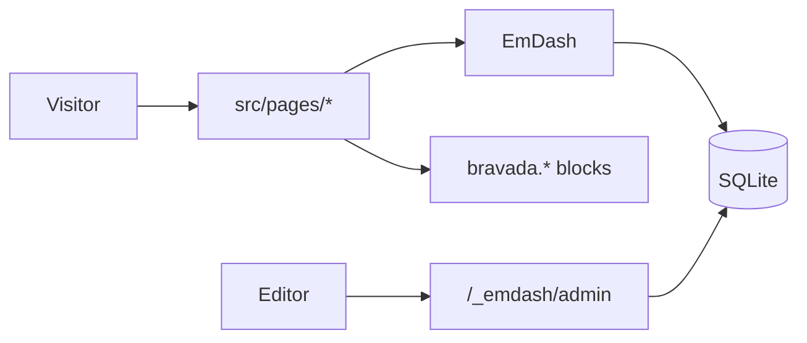

# Bravada for Astro

A port of the
[Bravada](https://www.cryoutcreations.eu/wordpress-themes/bravada) WordPress
theme (Cryout Creations) to [Astro](https://astro.build), powered by
[EmDash](https://emdashcms.com) and built on the EmDash blog template. Runs on
any Node.js server with SQLite and local file storage.

The port carries Bravada's visual language — Playfair Display headings over
Mulish body text, the teal/gold palette, the gold-ribbon wordmark, highlighter
title sweeps, ghost section headers, the slow zoom-under-teal image hover, the
dark footer — and rebuilds its **landing page as EmDash sections**: reusable
blocks editors drop into any Portable Text field with the `/section` command.

## Landing-page sections

Bravada's front-page elements map to four custom Portable Text block types,
each seeded as a section:

| Section (`/section`) | Block type | Bravada original |
|---|---|---|
| Hero banner | `bravada.hero` | LP slider / static slider |
| Icon blocks | `bravada.blocks` | LP blocks |
| Featured boxes | `bravada.boxes` | LP boxes (animated) |
| Text band | `bravada.text` | LP text areas |

The homepage renders the page with slug `home` full-width above the latest
posts — the seed ships one assembled from the four sections. Edit, reorder or
delete bands there like any other content; delete the page to fall back to a
plain blog front page. Sections work in posts and pages too, on any site the
schema grows into (the CMS content model is data, so extra collections scale
without theme changes).

Block components live in `src/components/blocks/` and are registered in
`src/components/RichText.astro` (use it wherever editor content renders).
Image fields on hero/boxes blocks take a URL — a media-library file URL or an
external one.

## Structure

- `seed/seed.minimal.json` — the same structure with no demo content, for
  starting a clean site (see First run).
- `seed/seed.json` — collections (posts, pages), category/tag taxonomies,
  primary + social menus, sidebar/footer widget areas, the Bravada sections,
  and sample content (a `home` landing page + demo posts).
- `src/styles/theme.css` — the Bravada design tokens and signature styles.
  All colors use `light-dark()`; dark mode is automatic.
- `src/styles/tokens.css` — template defaults (don't edit; override in theme.css).

## Pages

| Page | Route |
|---|---|
| Homepage (landing + latest) | `/` |
| All posts | `/posts` |
| Single post | `/posts/:slug` |
| Category / tag archive | `/category/:slug`, `/tag/:slug` |
| Portfolio project | `/portfolio/:slug` |
| Project type / tag archive | `/project-type/:slug`, `/project-tag/:slug` |
| Product | `/product/:slug` |
| Search | `/search` |
| Static pages (about, contact, shop, …) | `/:slug` |

RSS lives at `/rss.xml`; `sitemap.xml` and `robots.txt` are served by the
EmDash integration.

## Architecture

Everything is server-rendered (`output: "server"`): content lives in SQLite
and pages query it per request, so edits in the admin are live immediately —
no rebuilds.



The theme layer is deliberately thin: routes in `src/pages/` query EmDash and
hand Portable Text to `RichText.astro`, which dispatches the four
`bravada.*` block types; design tokens in `src/styles/theme.css` restyle the
base template without touching its layout primitives.

## First run

Requires **Node 20+** and **pnpm** (fonts are fetched from Google at build
time, so the first build needs network access).

```bash
pnpm install
npx emdash dev                    # 1. localhost:4321 — migrations run, but the site starts EMPTY
npx emdash seed seed/seed.json    # 2. apply the full Bravada demo content
```

Then visit `http://localhost:4321/_emdash/admin` — the setup wizard creates
your first admin account — and reload the homepage to see the demo landing
page.

Prefer to skip the demo content? Seed the structure only (collections,
taxonomies, menus, widget areas, sections — no posts, shop, or portfolio):

```bash
npx emdash seed seed/seed.minimal.json
```

To start over at any point: stop the dev server, `rm data.db*`, and run
`npx emdash dev` again.

Full-text search, RSS, sitemap/robots, SEO/JSON-LD, comments-ready routes,
dark/light mode and the audit-log plugin come from EmDash and the underlying
blog template.

## Make it yours

- **Site title, tagline, logo** live in the CMS, not the code: admin →
  Settings. The header wordmark, footer, RSS feed, and meta titles all follow.
- **Menus and widgets** are admin-editable (Appearance → Menus / Widgets);
  the seed's `primary`, `social`, and `mobile` menus are starting points.
- **Colours and fonts**: override tokens in `src/styles/theme.css` (see the
  notes at the top of that file); webfonts are configured in
  `astro.config.mjs`. Don't edit `src/styles/tokens.css`.
- **Post-page furniture**: admin → Plugins → Bravada Theme toggles the
  post author attribution and the docked prev/next buttons (see Theme
  settings below).

## Deploy

The template builds to a self-hosted Node server:

```bash
pnpm build
node ./dist/server/entry.mjs   # honours HOST / PORT env vars
```

Production checklist:

1. **Set the Site URL** (admin → Settings) — canonicals, Open Graph URLs,
   the sitemap, and the RSS feed all derive absolute URLs from it.
2. **Generate an encryption key**: `npx emdash secrets generate` and set
   `EMDASH_ENCRYPTION_KEY` in the server environment (encrypts plugin
   secrets at rest).
3. **Persist `data.db*` and `uploads/`** — both live on disk; put them on a
   volume that survives restarts and back them up together.

For other targets (Cloudflare, Postgres, S3 storage) see the
[EmDash deployment docs](https://docs.emdashcms.com).

## Theme settings

Post-page display toggles live in a template-local plugin
(`src/plugins/bravada-theme/`) and are edited in the admin:
**Plugins → Bravada Theme**. Changes apply immediately — no restart, no
seed edits.

- **Show post author** (default on) — post pages attribute content to
  the byline in three places: the avatar + name chip in the post hero, the
  byline in the article meta line, and the author card below the article.
  For a single-author site where attribution is noise, turn all three off.
  The hero excerpt (the entry's Excerpt field, which is also the
  search-engine description) is independent of author display — it keeps
  rendering, exactly as Bravada treats its excerpt and author-meta options
  as separate toggles.
- **Show prev/next buttons** (default on) — the docked buttons that fade
  in beside the article on scroll (demo `#nav-fixed`). Turning them off
  leaves the full-bleed previous/next image band above the footer intact.

## Documentation

- [EmDash docs](https://docs.emdashcms.com) — querying content, schema,
  menus, widgets, plugins, deployment.
- [EmDash docs MCP](https://docs.emdashcms.com/docs-mcp) — this repo ships
  `.mcp.json` / `.cursor/mcp.json` / `.vscode/mcp.json`, so Claude Code,
  Cursor, and VS Code can search the EmDash docs while you work.
- [Astro docs](https://docs.astro.build) — the underlying framework.
- [Bravada](https://www.cryoutcreations.eu/wordpress-themes/bravada) — the
  upstream WordPress theme this port is matched against.

## License

© 2026 vhs. A port of Bravada, © 2020–25
[Cryout Creations](https://www.cryoutcreations.eu). Licensed under
GPL-3.0-or-later — see [LICENSE](./LICENSE) for the full text and
[CREDITS.md](./CREDITS.md) for attribution details.
