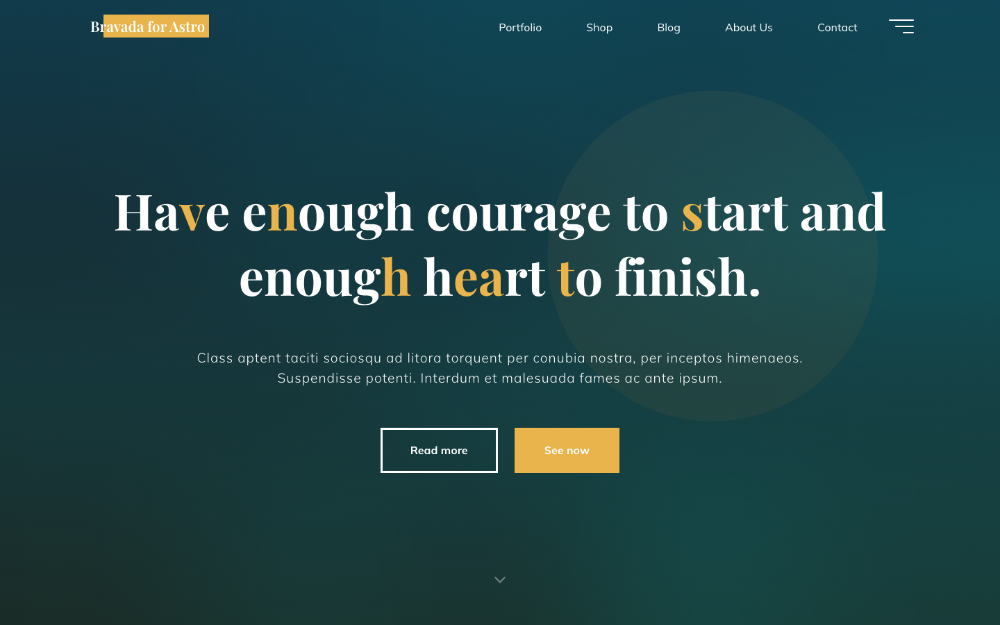
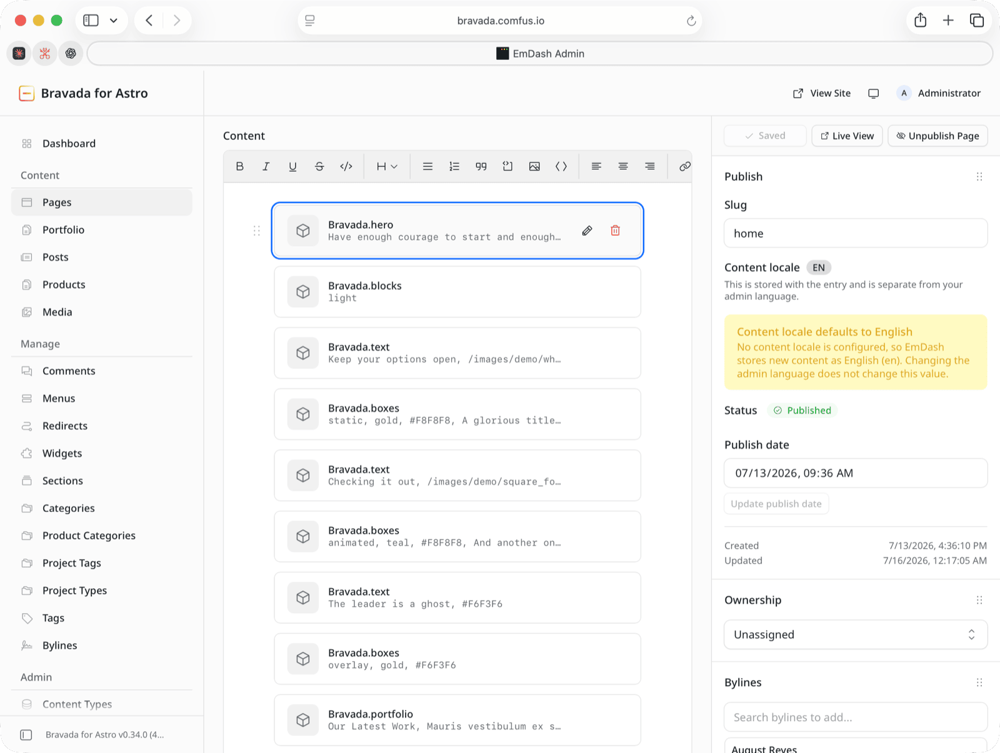
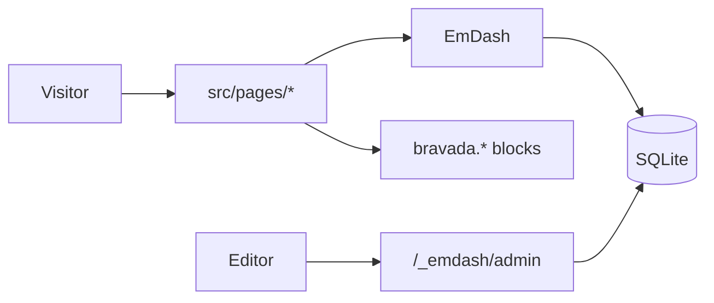

# Bravada for Astro

[](https://emdashcms.com)
[](https://nodejs.org)
[](https://github.com/vhscom/emdash-theme-bravada/actions/workflows/ci.yml)
[](./LICENSE)



**Live demo:** [bravada.comfus.io](https://bravada.comfus.io)

A port of the
[Bravada](https://www.cryoutcreations.eu/wordpress-themes/bravada) WordPress
theme (Cryout Creations) to [Astro](https://astro.build), powered by
[EmDash](https://emdashcms.com) and built on the EmDash blog template. Runs on
any Node.js server with SQLite and local file storage.

The port carries Bravada's visual language — Playfair Display headings over
Mulish body text, the teal/gold palette, the gold-ribbon wordmark, highlighter
title sweeps, ghost section headers, the slow zoom-under-teal image hover, the
dark footer — and rebuilds its **landing page as Portable Text blocks**:
bands an editor can reorder, edit or delete like any other content, with
reusable groups of them saved as EmDash sections.

Every demo image — heroes, headers, shop and portfolio photography — is real
CC0/CC BY photography rather than placeholder art; see
[CREDITS.md](./CREDITS.md) for the full attribution table. Local images ship
with pre-built AVIF/WebP siblings served through `<picture>` for the hero,
page headers, portfolio, and project-grid images.



The landing page is content, not code. Its bands are `bravada.*` blocks in
the admin's editor — reorder them by dragging, edit one in place, or add
another to any page. Posts, portfolio, products, menus, widgets and media
live in the same admin at `/_emdash/admin`.

## Blocks

Bravada's page furniture is rebuilt as custom Portable Text block types.
Components live in `src/components/blocks/` and are dispatched by
`src/components/RichText.astro` — use that wherever editor content renders,
and every block type comes with it.

The four that make up Bravada's front page:

| Block type | Bravada original |
|---|---|
| `bravada.hero` | LP slider / static slider |
| `bravada.blocks` | LP blocks |
| `bravada.boxes` | LP boxes (animated) |
| `bravada.text` | LP text areas |

The rest, with where the demo puts them:

| Block type | Renders | Seeded on |
|---|---|---|
| `bravada.portfolio` | Portfolio grid band | home, portfolio |
| `bravada.testimonials` | Testimonial carousel | home |
| `bravada.team` | Team member grid | about-us |
| `bravada.accordion` | Collapsible panels | about-us |
| `bravada.contactform` | Contact form | contact |
| `bravada.map` | Map band | contact |
| `bravada.shopgrid` | Product grid | shop |
| `bravada.postswidget` | Recent posts | `sidebar-b` |
| `bravada.products` | Product list | `page-sidebar` |
| `bravada.search` | Search box | `sidebar-b` |
| `bravada.tabswidget` | Tabbed widget | `sidebar-b` |
| `bravada.widgetportfolio` | Portfolio thumbnails | footer |
| `bravada.projectgrid` | Project grid | used by project archives |
| `bravada.projectfeatured` | Featured project | used by `/portfolio/:slug` |

Image fields on the hero and boxes blocks take a plain URL string — a
media-library file URL or an external one — not the `{ src, alt }` object
that entry image fields use.

### Blocks vs sections

A **block** is one band of content sitting inside a Portable Text field. A
**section** is a saved, reusable group of blocks that an editor drops into
any Portable Text field with the `/section` command.

The two are independent, which is worth knowing before you go editing:
**the seeded home page holds its own inline blocks, not references to
sections.** Editing the `hero-slider` section will not change the homepage.
The seed ships nine sections — `hero-slider`, `icon-blocks`,
`icon-blocks-dark`, `text-band`, `featured-boxes-static`,
`featured-boxes-animated`, `portfolio-grid`, `testimonials` and
`footer-portfolio` — as ready-made starting points, and several are
variations on the same block type.

The homepage renders the page with slug `home` full-width above the latest
posts; the seeded one is thirteen blocks across six types. Edit, reorder or
delete bands there like any other content, or delete the page to fall back
to a plain blog front page.

## Structure

- `seed/seed.minimal.json` — the same structure with no demo content, for
  starting a clean site (see First run).
- `seed/seed.json` — four collections (posts, pages, portfolio, products),
  five taxonomies (category, tag, project-type, project-tag,
  product-category), primary/social/mobile menus, sidebar and footer widget
  areas, nine Bravada sections, and the demo content: a `home` landing page,
  twelve posts, twelve projects, twenty-three products and the template
  pages.
- `src/styles/theme.css` — the Bravada design tokens and signature styles.
  All colors use `light-dark()`; dark mode is automatic.
- `src/styles/tokens.css` — template defaults (don't edit; override in theme.css).

## Pages

| Page | Route |
|---|---|
| Homepage (landing + latest) | `/` |
| All posts | `/posts` (ten per page, `?page=N`) |
| Single post | `/posts/:slug` |
| Category / tag archive | `/category/:slug`, `/tag/:slug` |
| Portfolio project | `/portfolio/:slug` |
| Project type / tag archive | `/project-type/:slug`, `/project-tag/:slug` |
| Product | `/product/:slug` (zoomable gallery: hover lens, click for a magnifier lightbox) |
| Search | `/search` |
| Static pages (about, contact, shop, …) | `/:slug` |

RSS lives at `/rss.xml`; `sitemap.xml` and `robots.txt` are served by the
EmDash integration.

One thing to do once, after seeding: open the **Home** page in the admin and
tick **hide from search engines** in its SEO panel. The landing page is a
real page entry, so it also has a slug — `/home` — which this theme redirects
to `/` the way WordPress redirects a static front page. The sitemap is built
from content rather than routes, though, so without that flag it lists
`/home` and search engines are handed a URL that only redirects. The flag
removes it from the sitemap and leaves `/` untouched, because the home route
doesn't read per-entry SEO. There is no seed field for it, which is why it
can't ship pre-set.

### Let crawlers reach your images

The default `robots.txt` disallows `/_emdash/`, which is where EmDash's
media proxy serves uploads from (`/_emdash/api/media/file/…`). Social
preview images always come from there — `getMediaUrl` in
`src/utils/media-url.ts` builds them that way — so on a stock install
every `og:image` sits behind that Disallow.

Whether your on-page images are blocked too depends on how they are
served. Astro's image endpoint, an external provider such as Cloudflare
Images, and a public R2 or CDN origin all sit outside `/_emdash/` and
are unaffected by the rule. Check what your pages actually emit before
assuming one way or the other.

Either way, the fix goes in the site settings SEO panel (the
`seo.robotsTxt` field), which EmDash serves verbatim in place of its
default:

```
User-agent: *
Allow: /

# Uploaded images sit under the admin prefix — keep them crawlable.
Allow: /_emdash/api/media/file/

# Admin UI, content API and auth routes stay out of the index.
Disallow: /_emdash/
```

Google resolves a conflict between `Allow` and `Disallow` by the longest
matching path, so the media rule wins while everything else under
`/_emdash/` stays blocked. You don't need a `Sitemap:` line — EmDash
appends one when your text doesn't already name it.

## Architecture

Everything is server-rendered (`output: "server"`): content lives in SQLite
and pages query it per request, so edits in the admin are live immediately —
no rebuilds.


```mermaid
flowchart LR
    V[Visitor] --> P["src/pages/*"] --> Q[EmDash] --> DB[(SQLite)]
    P --> B["bravada.* blocks"]
    E[Editor] --> A["/_emdash/admin"] --> DB
```

The theme layer is deliberately thin: routes in `src/pages/` query EmDash and
hand Portable Text to `RichText.astro`, which dispatches the
`bravada.*` block types; design tokens in `src/styles/theme.css` restyle the
base template without touching its layout primitives.

## First run

Start from a clean copy — either click **Use this template** on GitHub, or:

```bash
npm create astro@latest -- --template vhscom/emdash-theme-bravada
```

Requires **Node 22+** and **pnpm** (fonts are fetched from Google at build
time, so the first build needs network access).

```bash
pnpm install
pnpm dev                          # localhost:4321 — migrations run, but the site starts EMPTY
```

Then visit `http://localhost:4321/_emdash/admin` — the setup wizard creates
your first admin account and offers **"Include sample content"**, which
applies the full Bravada demo seed for you. Prefer the command line?

```bash
npx emdash seed seed/seed.json    # same thing, without the wizard checkbox
```

Prefer to skip the demo content? Seed the structure only (collections,
taxonomies, menus, widget areas, sections — no posts, shop, or portfolio):

```bash
npx emdash seed seed/seed.minimal.json
```

To start over at any point: stop the dev server, `rm data.db*`, and run
`pnpm dev` again.

Full-text search, RSS, sitemap/robots, SEO/JSON-LD, comments-ready routes,
dark/light mode and the audit-log plugin come from EmDash and the underlying
blog template.

## Make it yours

- **Site title, tagline, logo** live in the CMS, not the code: admin →
  Settings. The header wordmark, footer, RSS feed, and meta titles all follow.
- **Menus and widgets** are admin-editable (Appearance → Menus / Widgets);
  the seed's `primary`, `social`, and `mobile` menus are starting points.
- **Colours and fonts**: override tokens in `src/styles/theme.css` (see the
  notes at the top of that file); webfonts are configured in
  `astro.config.mjs`. Don't edit `src/styles/tokens.css`.

  Every colour is declared with `light-dark(<light>, <dark>)`, so each token
  carries both modes and there is no separate dark palette to maintain —
  overriding with a plain colour changes both at once. The tokens worth
  knowing: `--color-brand` / `--color-brand-hover` / `--color-on-brand`,
  `--color-bg` / `--color-surface` / `--color-text` / `--color-border`,
  `--font-body` / `--font-heading` / `--font-display` / `--font-mono`,
  `--content-width` (680px article column), `--wide-width` (1200px), and
  `--sidebar-width` (320px).

  > **A note before you "fix" the contrast:** the palette deliberately
  > reproduces the original Bravada demo — gold `#E9B44C` and teal `#0F8B8D`
  > — rather than meeting WCAG AA contrast. That's a fidelity decision, not
  > an oversight. Everything else in the theme (focus order, landmarks,
  > keyboard operation, reduced motion) does target AA.
- **Post-page furniture**: admin → Plugins → Bravada Theme toggles the
  post author attribution and the docked prev/next buttons (see Theme
  settings below).

## Deploy

The template builds to a self-hosted Node server:

```bash
pnpm build
node ./dist/server/entry.mjs   # honours HOST / PORT env vars
```

Production checklist:

1. **Set the Site URL** (admin → Settings) — canonicals, Open Graph URLs,
   the sitemap, and the RSS feed all derive absolute URLs from it.
2. **Generate an encryption key**: `npx emdash secrets generate` and set
   `EMDASH_ENCRYPTION_KEY` in the server environment (encrypts plugin
   secrets at rest).
3. **Persist `data.db*` and `uploads/`** — both live on disk; put them on a
   volume that survives restarts and back them up together.

### Cloudflare Workers

The live demo runs from the `deploy/cloudflare` branch, which swaps the Node
adapter for `@astrojs/cloudflare` and backs the site with D1, KV, and R2
(`wrangler.jsonc`). Keep `emdash` and `@emdash-cms/cloudflare` on the same
version — a mismatch surfaces at runtime, not at build time.

That branch pins `vite` and `rolldown` via `overrides` in
`pnpm-workspace.yaml`. Newer rolldown emits a bare `require("path")` shim for
CJS dependencies that throws at module init under workerd, which a successful
`astro build` will not catch. Smoke-test the built Worker before deploying:

```bash
npx wrangler dev        # runs the real Workers runtime locally
npx wrangler deploy
```

For other targets (Postgres, S3 storage) see the
[EmDash deployment docs](https://docs.emdashcms.com).

### Working against a deployed site

The CLI can talk to a live site, not just a local one, which beats editing
the database underneath it — writes go through the site's own API, so
revisions and cache invalidation are handled for you. Sign in once:

```bash
npx emdash login --url https://your-site.example.com
```

It prints a code and a URL (`/_emdash/admin/device`); open that in a
browser, enter the code, and authenticate as you normally would. The token
is saved to `~/.config/emdash/auth.json`, so from then on any remote
command just needs `--url`:

```bash
npx emdash content list posts --url https://your-site.example.com
npx emdash schema get products --url https://your-site.example.com
npx emdash types --url https://your-site.example.com
```

Two things to know before you rely on it:

- **Updating content writes a draft, it does not publish.** The entry shows
  as "published with pending changes" in the admin and the public page keeps
  serving the previous version until you follow up with
  `emdash content publish`. Easy to mistake for a caching problem.
- **The CLI cannot create every field type.** `schema add-field` takes no
  sub-fields and no select options, so a repeater or a select has to be built
  from **Content Types** in the admin. It *can* delete such a field, which is
  a good way to strand yourself — check you can rebuild a field before
  removing it.

## Theme settings

Post-page display toggles live in a template-local plugin
(`src/plugins/bravada-theme/`) and are edited in the admin:
**Plugins → Bravada Theme**. Changes apply immediately — no restart, no
seed edits.

- **Show post author** (default on) — post pages attribute content to
  the byline in three places: the avatar + name chip in the post hero, the
  byline in the article meta line, and the author card below the article.
  For a single-author site where attribution is noise, turn all three off.
  The hero excerpt (the entry's Excerpt field, which is also the
  search-engine description) is independent of author display — it keeps
  rendering, exactly as Bravada treats its excerpt and author-meta options
  as separate toggles.
- **Show prev/next buttons** (default on) — the docked buttons that fade
  in beside the article on scroll (demo `#nav-fixed`). Turning them off
  leaves the full-bleed previous/next image band above the footer intact.

## Documentation

- [EmDash docs](https://docs.emdashcms.com) — querying content, schema,
  menus, widgets, plugins, deployment.
- [EmDash docs MCP](https://docs.emdashcms.com/docs-mcp) — this repo ships
  `.mcp.json` / `.cursor/mcp.json` / `.vscode/mcp.json`, so Claude Code,
  Cursor, and VS Code can search the EmDash docs while you work.
- [Astro docs](https://docs.astro.build) — the underlying framework.
- [Bravada](https://www.cryoutcreations.eu/wordpress-themes/bravada) — the
  upstream WordPress theme this port is matched against.

## License

© 2026 vhs. A port of Bravada, © 2020–25
[Cryout Creations](https://www.cryoutcreations.eu). Licensed under
GPL-3.0-or-later — see [LICENSE](./LICENSE) for the full text and
[CREDITS.md](./CREDITS.md) for attribution details.

Maintained by vhs at [Comfusion](https://comfus.io).
